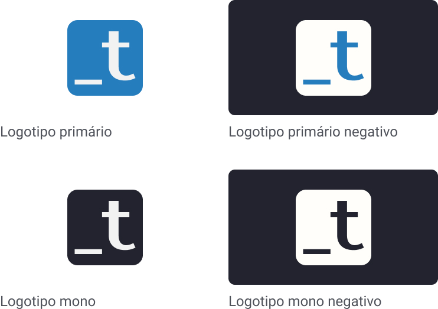

  

# Guia de uso da marca Training Center

Neste guia encontramos as cores da nossa marca e guia de aplicação do logo, assim como templates para YouTube, banners de divulgação de meetups e outros.

# Cores

Ao criar algum material de divulgação de **nossas iniciativas** (meetups, conteúdo, etc.), atente-se a seguir as cores definidas por nossos designers.

Caso seja somente a utilização do nosso logo em um material de divulgação de sua própria iniciativa, basta seguir o [guia para a aplicação do logo](#logo).

## Paleta principal

| Primary | Light Blue | Dark Blue | Dark | Light | Green | Orange | Red | 
| ------- | ---------- | --------- | ---------------- | ----- | ----- | ------ | --- |
|  |  |  |  |  |  |  |  | 
| `#267dbd` | `#1daed7` | `#223266` | `#22232e` | `#f6f5f0` | `#49b478` | `#fcaf38` | `#ec5252` | 

## Logo

O logotipo do Training Center é uma assinatura universal que usamos em todas os nossos projetos e nossas comunicações. É importante que ele não seja editado, alterado, distorcido ou recolorido. 

### Downloads
- [SVG](./assets/svg)
- [PNG](./assets/png)
- [JPG](./assets/jpg)
